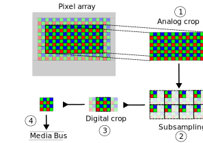

.. SPDX-License-Identifier: CC-BY-SA-4.0

.. include:: documentation-contents.rst

.. _camera-sensor-model:

.. todo: Move to Doxygen-generated documentation

The libcamera camera sensor model
=================================

libcamera defines an abstract camera sensor model in order to provide
a description of each of the processing steps that result in image data being
sent on the media bus and that form the image stream delivered to applications.

Applications should use the abstract camera sensor model defined here to
precisely control the operations of the camera sensor.

The libcamera camera sensor model targets image sensors producing frames in
RAW format, delivered through a MIPI CSI-2 compliant bus implementation.

The abstract sensor model maps libcamera components to the characteristics and
operations of an image sensor, and serves as a reference to model the libcamera
CameraSensor class and SensorConfiguration classes and operations.

In order to control the configuration of the camera sensor through the
SensorConfiguration class, applications should understand this model and map it
to the combination of image sensor and kernel driver in use.

The camera sensor model defined here is based on the *MIPI CCS specification*,
particularly on *Section 8.2 - Image readout* of *Chapter 8 - Video Timings*.

Glossary
--------

.. glossary::

   Pixel array
      The full grid of pixels, active and inactive ones

   Pixel array active area
      The portion(s) of the pixel array that contains valid and readable pixels;
      corresponds to the libcamera properties::PixelArrayActiveAreas

   Analog crop rectangle
      The portion of the *pixel array active area* which is read out and passed
      to further processing stages

   Subsampling
      Pixel processing techniques that reduce the image size by binning or by
      skipping adjacent pixels

   Digital crop
      Crop of the sub-sampled image data before scaling

   Frame output
      The frame (image) as output on the media bus by the camera sensor

Camera sensor model
-------------------

The abstract sensor model is described in the following diagram.

1. The sensor reads pixels from the *pixel array*. The pixels being read out are
   selected by the *analog crop rectangle*.

2. The pixels can be subsampled to reduce the image size without affecting the
   field of view. Two subsampling techniques can be used:

   - Binning: combines adjacent pixels of the same colour by averaging or
     summing their values, in the analog domain and/or the digital domain.

      .. figure:: binning.svg

   - Skipping: skips the read out of a number of adjacent pixels.

      .. figure:: skipping.svg

3. The output of the optional sub-sampling stage is then cropped after the
   conversion of the analogue pixel values in the digital domain.

4. The resulting output frame is sent on the media bus by the sensor.

Camera Sensor configuration parameters
--------------------------------------

The libcamera camera sensor model defines parameters that allow users to
control:

1. The image format bit depth

2. The size and position of the  *Analog crop rectangle*

3. The subsampling factors used to downscale the pixel array readout data to a
   smaller frame size without reducing the image *field of view*. Two
   configuration parameters are made available to control the downscaling
   factor:

   - binning
      A vertical and horizontal binning factor can be specified, the image
      will be downscaled in its vertical and horizontal sizes by the specified
      factor.

      .. code-block:: c
         :caption: Definition: The horizontal and vertical binning factors

         horizontal_binning = xBin;
         vertical_binning = yBin;

   - skipping
      Skipping reduces the image resolution by skipping the read-out of a number
      of adjacent pixels. The skipping factor is specified by the 'increment'
      number (number of pixels to 'skip') in the vertical and horizontal
      directions and for even and odd rows and columns.

      .. code-block:: c
         :caption: Definition: The horizontal and vertical skipping factors

         horizontal_skipping = (xOddInc + xEvenInc) / 2;
         vertical_skipping = (yOddInc + yEvenInc) / 2;

   Different sensors perform the binning and skipping stages in different
   orders. For the sake of computing the final output image size the order of
   execution is not relevant. The overall down-scaling factor is obtained by
   combining the binning and skipping factors.

   .. code-block:: c
      :caption: Definition: The total scaling factor (binning + sub-sampling)

      total_horizontal_downscale = horizontal_binning + horizontal_skipping;
      total_vertical_downscale = vertical_binning + vertical_skipping;

4. The output size is used to specify any additional cropping on the sub-sampled
   frame.

5. The total line length and frame height (*visibile* pixels + *blankings*) as
   sent on the MIPI CSI-2 bus.

6. The pixel transmission rate on the MIPI CSI-2 bus.

The above parameters are combined to obtain the following high-level
configurations:

- **frame output size**

   Obtained by applying a crop to the physical pixel array size in the analog
   domain, followed by optional binning and sub-sampling (in any order),
   followed by an optional crop step in the output digital domain.

- **frame rate**

   The combination of the *total frame size*, the image format *bit depth* and
   the *pixel rate* of the data sent on the MIPI CSI-2 bus allows to compute the
   image stream frame rate. The equation is the well known:

   .. code-block:: c

      frame_duration = total_frame_size / pixel_rate;
      frame_rate = 1 / frame_duration;

   where the *pixel_rate* parameter is the result of the sensor's configuration
   of the MIPI CSI-2 bus *(the following formula applies to MIPI CSI-2 when
   used on MIPI D-PHY physical protocol layer only)*

   .. code-block:: c

      pixel_rate = csi_2_link_freq * 2 * nr_of_lanes / bits_per_sample;
